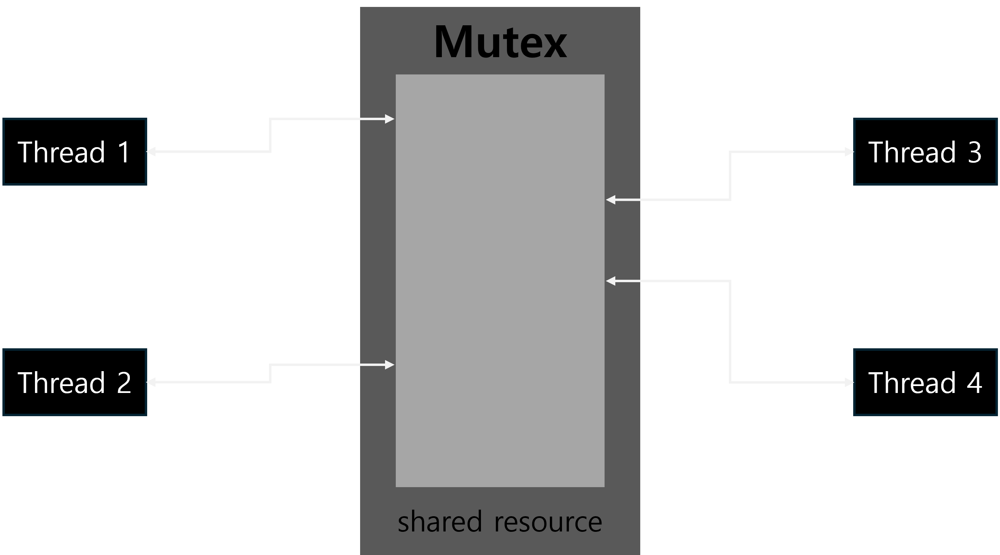

# Mutex

<figure><figcaption></figcaption></figure>

* **Ownership of Resources**: A mutex is owned by the thread that locks it, and only that thread can unlock it.
* **Target for Synchronization**: It is used to control access to a single shared resource.
* **State**: A mutex has a binary state (0 or 1), allowing only one thread to access the resource at a time.
* **Use Case**: Suitable for scenarios where mutual exclusion is needed for a single resource (e.g., a file or a data structure).
