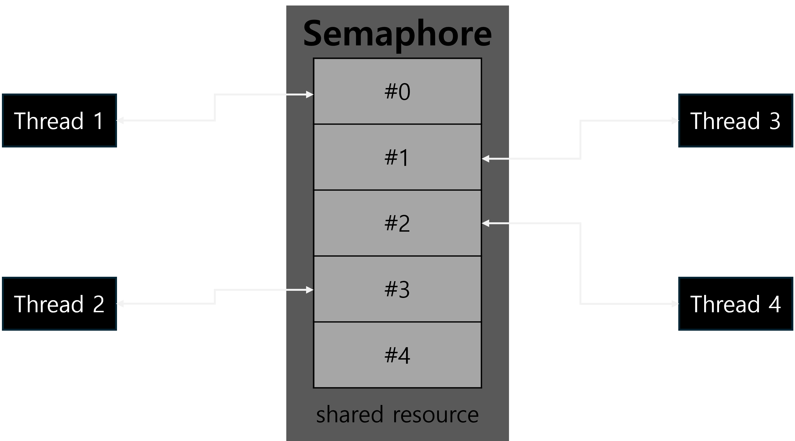

# Semaphore

<figure><figcaption></figcaption></figure>

* **No Ownership of Resources**: A semaphore does not involve ownership; any thread can increase (signal) or decrease (wait) the semaphore.
* **Target for Synchronization**: It is used to control access to multiple instances of a shared resource.
* **State**: A semaphore holds an integer value, indicating how many threads can access the resource concurrently.
* **Use Case**: Ideal for controlling access to a limited number of resources (e.g., a server with a limited number of connections).
